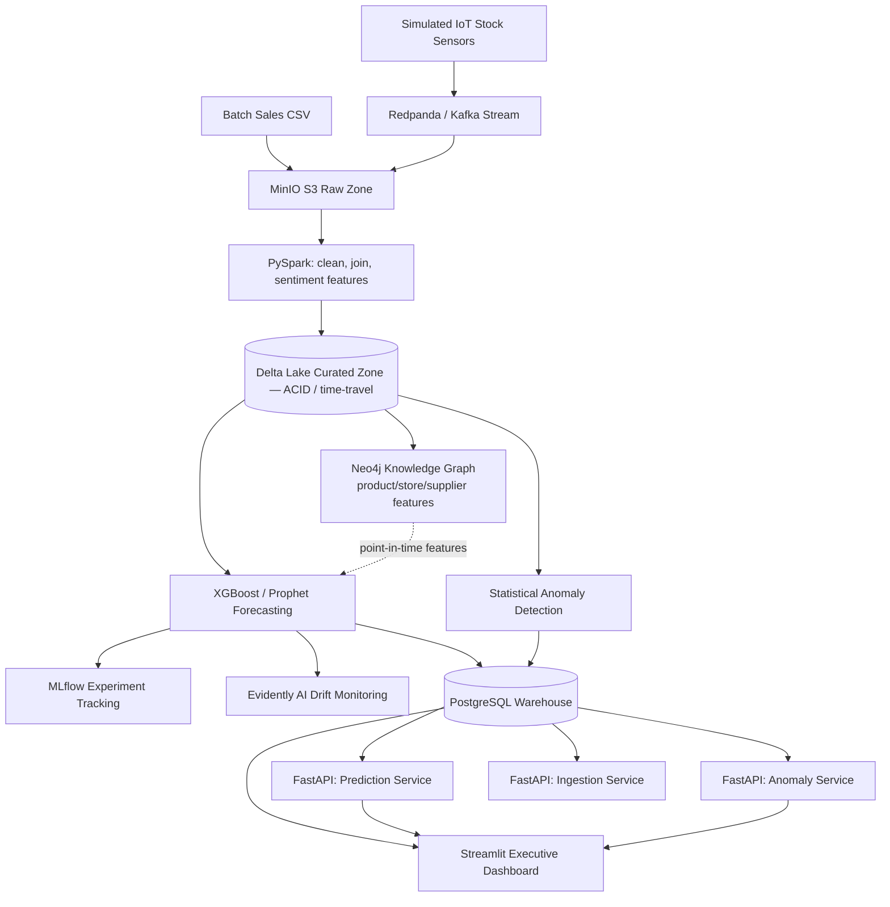

# ⚡ RetailPulse — Retail Demand Forecasting & Anomaly Detection Platform

[](https://retailnewpulse.streamlit.app)
[](https://python.org)
[](https://fastapi.tiangolo.com)
[](https://delta.io)
[](https://neo4j.com)
[](https://mlflow.org)
[](LICENSE)

**[🚀 Live Demo](https://retailnewpulse.streamlit.app)** — upload a retail sales export (or load the sample dataset) and get demand forecasts, anomaly alerts, and an executive dashboard.

An end-to-end retail demand forecasting and anomaly detection pipeline: batch + simulated streaming ingestion, a Delta Lake lakehouse, a Neo4j knowledge graph, gradient-boosted demand forecasting, statistical anomaly detection, MLOps monitoring, and an interactive Streamlit dashboard — built to demonstrate the full data-to-decision lifecycle, not just an isolated model.

## What this is (and isn't)

This is a **portfolio-grade data engineering + ML project** built with a public/synthetic FMCG retail dataset, not a system serving real stores. Every number below comes from an actual 28-day holdout backtest — nothing here is estimated. See [Known Limitations](#known-limitations) for an honest account of what's solid vs. still rough.

## Architecture




## Measured results

| Metric | Baseline (Holt-Winters) | XGBoost (production) | Graph-enhanced XGBoost (experimental) |
|---|---|---|---|
| Holdout MAPE (28 days) | 73.63% | **62.07%** (~11.6pp lower) | 62.01% |
| Holdout RMSE | 3.36 | **3.35** | 3.33 |
| MAE | 2.50 | **2.08** | 2.08 |
| Anomaly detection recall | — | 100% (3/3 injected synthetic stockouts detected) | — |
| Drift monitoring (Dec holdout vs. training) | — | **WARN** — 2/6 features drifted (33.3%); recalibration recommended | — |

The graph-enhanced model is not used in production — with only 10 SKUs and 4 substitute relationships, the knowledge graph is too sparse to reliably improve forecasts yet. The drift monitor's WARN verdict reflects a real seasonal shift detected in the December holdout window against the training distribution — reported as measured, not tuned to show a clean pass.

Full per-SKU breakdown in [`reports/backtest.md`](reports/backtest.md).

## Key features

- **Dual ingestion paths**: batch CSV loader + simulated real-time IoT/POS streaming via Kafka/Redpanda.
- **Delta Lake lakehouse**: ACID-compliant curated zone with schema enforcement and time-travel.
- **Knowledge graph enrichment**: Neo4j models product substitution and co-stocking relationships (experimental — see limitations).
- **XGBoost demand forecasting**: 28-day lag features, rolling statistics, calendar seasonality, shelf-stock signal, and review sentiment.
- **Statistical anomaly detection**: rolling z-score + shelf-stock cross-check flags stockout risk, demand spikes, and sensor mismatches.
- **MLOps**: MLflow experiment tracking + Evidently AI drift monitoring on every retrain.
- **Live upload → real pipeline**: uploading a CSV on the dashboard triggers the actual lakehouse transform, XGBoost training, and backtest — not a shortcut heuristic. Requires 35+ days of history to build lag features.
- **FastAPI microservices**: independent prediction, anomaly, and ingestion services, each with health checks.

## Tech stack

| Category | Technologies |
|---|---|
| Core & APIs | Python 3.11, FastAPI, Uvicorn, Pydantic |
| Data engineering | PySpark, Delta Lake, PostgreSQL, MinIO (S3-compatible) |
| Streaming & graph | Redpanda / Kafka, Neo4j |
| Machine learning | XGBoost, Prophet, scikit-learn, SciPy |
| MLOps | MLflow, Evidently AI, Pytest |
| Frontend | Streamlit, Plotly |
| Infrastructure | Docker, Docker Compose, Make |

## Repository layout

```
Retail-Pulse/
├── dashboard/          # Streamlit app (app.py, styles.py)
├── services/           # FastAPI microservices (prediction, anomaly, ingestion)
├── modeling/           # train_xgboost.py, train_prophet.py, anomaly_detection.py,
│                        # backtest.py, drift_monitor.py, mlflow_utils.py
├── transform/spark_jobs/  # clean_join.py, sentiment_feature.py
├── graph/               # Neo4j schema + point-in-time feature extraction
├── ingestion/            # batch_loader.py, iot_generator.py, stream_producer/consumer.py
├── warehouse/            # load_warehouse.py (Postgres, SQLite fallback)
├── data/raw_sample/      # seed dataset (immutable — uploads never write here)
├── data/uploads/         # isolated storage for user-uploaded datasets
├── reports/              # backtest.md, drift_report.html
├── tests/                # 15 pytest tests
└── docs/                 # PRD, architecture, implementation, API reference
```

## Quickstart

**Try it live**: [retailnewpulse.streamlit.app](https://retailnewpulse.streamlit.app) — no setup required.

**Run locally:**
```bash
git clone https://github.com/CaptainShyamal/Retail-Pulse.git
cd Retail-Pulse
cp .env.example .env
docker compose up -d      # MinIO, Postgres, Redpanda, Neo4j
make run-all               # full pipeline: ingest -> transform -> graph -> model -> backtest -> drift -> warehouse -> tests
make dashboard              # http://localhost:8501
```

## Testing

```bash
pytest tests/ -v   # 15 tests: ingestion contracts, service health, streaming schemas,
                    # graph leakage guard, MLflow logging, drift verdicts, warehouse idempotency
```

## Known limitations

- **Single-node local infrastructure** — Postgres, MinIO, Neo4j, Redpanda all run as local Docker containers; the public deployment runs the Streamlit dashboard only.
- **Small synthetic catalog** — 10 SKUs, 5 stores; sensor data is simulated, not from real hardware.
- **Forecast accuracy is moderate, not high** (~62% MAPE) — expected given the small catalog and dataset size; reported honestly rather than inflated.
- **Knowledge graph features are experimental** and excluded from the production model due to catalog sparsity.
- **Drift monitor currently reports WARN**, not PASS, on the December holdout — a real, measured seasonal shift, not a bug.

## Documentation

- [`docs/PRD.md`](docs/PRD.md) — requirements, goals, success metrics
- [`docs/ARCHITECTURE.md`](docs/ARCHITECTURE.md) — full data flow and design decisions
- [`docs/IMPLEMENTATION.md`](docs/IMPLEMENTATION.md) — data contracts, module notes
- [`docs/API_REFERENCE.md`](docs/API_REFERENCE.md) — endpoints, env vars, external services
- [`reports/backtest.md`](reports/backtest.md) — full per-SKU accuracy report

## License

MIT — see [LICENSE](LICENSE).
