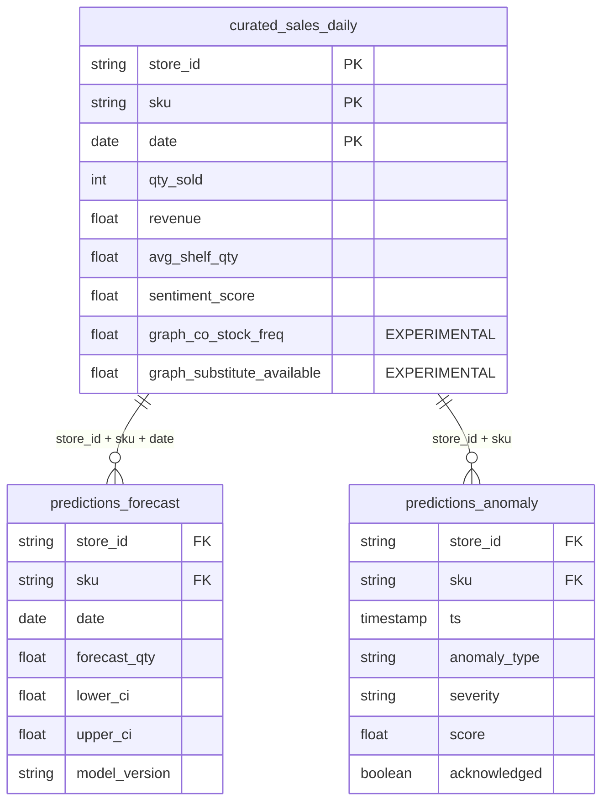

# Power BI Desktop Integration Guide — RetailPulse

This guide provides instructions for connecting **Power BI Desktop** directly to the RetailPulse PostgreSQL warehouse layer for executive reporting and operational analytics.

---

## 1. Database Connection Configuration

No external cloud account or paid connector is required. Use the native PostgreSQL connector in Power BI Desktop.

| Parameter | Value |
| :--- | :--- |
| **Connector** | `Get Data` → `Database` → `PostgreSQL database` |
| **Server** | `localhost:5432` |
| **Database** | `retailpulse` |
| **Data Connectivity Mode** | **DirectQuery** (for live telemetry) or **Import** (for high-speed in-memory cache) |
| **Authentication** | Username: `retailpulse` / Password: `changeme123` |

---

## 2. Data Model & Relationships

Load the 3 synchronized warehouse tables:



---

## 3. Essential DAX Business Measures

Paste the following DAX calculations into your Power BI Data Model:

```dax
// 1. Total Historical Revenue
Total Revenue = SUM(curated_sales_daily[revenue])

// 2. Total Units Sold
Total Units Sold = SUM(curated_sales_daily[qty_sold])

// 3. 14-Day Projected Demand
Projected Demand = SUM(predictions_forecast[forecast_qty])

// 4. Critical Stockout Alert Count
Open Stockout Alerts = 
CALCULATE(
    COUNTROWS(predictions_anomaly),
    predictions_anomaly[anomaly_type] = "stockout_risk",
    predictions_anomaly[acknowledged] = FALSE()
)

// 5. Forecast Accuracy (Weighted Absolute Percentage Error)
WAPE Accuracy = 
VAR Actuals = SUM(curated_sales_daily[qty_sold])
VAR AbsError = SUMX(
    RELATEDTABLE(curated_sales_daily),
    ABS(curated_sales_daily[qty_sold] - RELATED(predictions_forecast[forecast_qty]))
)
RETURN
IF(Actuals > 0, 1 - (AbsError / Actuals), 1.0)
```

---

## 4. Recommended Dashboard Visuals

1. **KPI Ribbon**: Total Revenue, Units Sold, 14-Day Forecast Demand, Active Stockout Alerts.
2. **Time-Series Forecast Ribbon**: Line chart displaying Actual Sales vs `forecast_qty` with shaded confidence bands (`lower_ci` to `upper_ci`).
3. **Inventory Risk Heatmap**: Matrix visual by `store_id` vs `sku`, colored by `avg_shelf_qty` (< 5 units = Red highlight).
4. **Anomaly Feed**: Table visual filtered by `acknowledged = false` showing timestamp, anomaly type, and severity.
